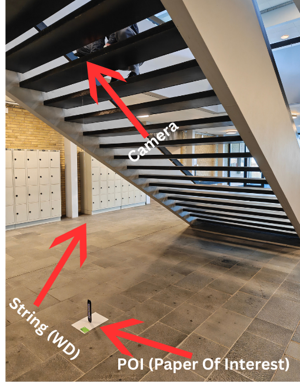
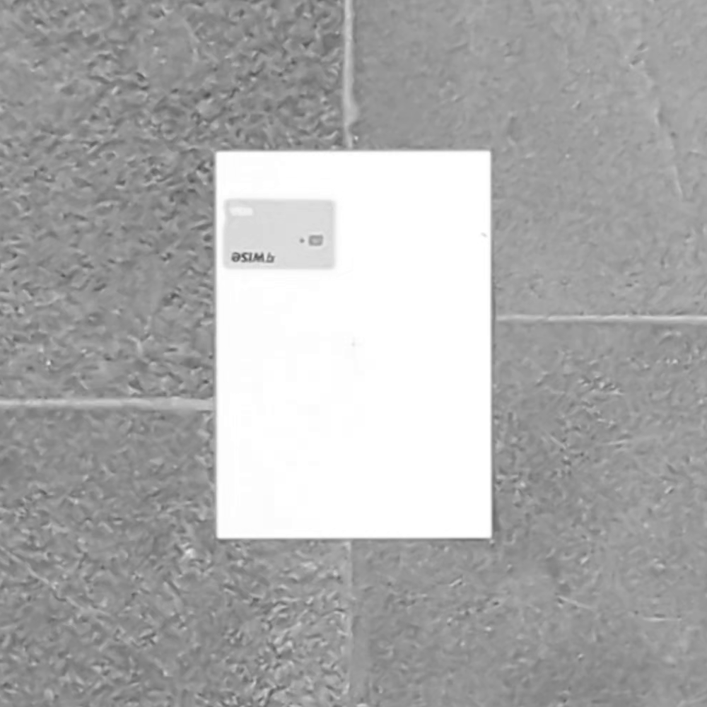
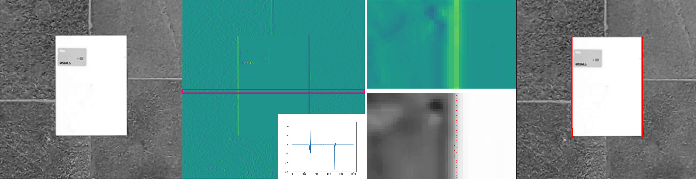
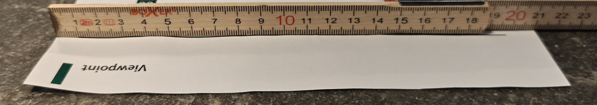

_Latest Page Update: 23-09-2026_

***Solution is now available! Download the full solution from here:*** [Solution](../downloads/sol_material-2.zip){ .md-button .md-button--primary .inline-button }

# Exercise2 - Cameras and Lenses

## Part 1 - Warming up
We'll start by doing some basic geometric operations to get you up to speed.

### Exercise 1

Explain how to calculate the angle $\theta$ when $a$ and $b$ is given
in the figure below. Calculate $\theta$ (in degrees) when
$a = 10$ and $b=3$ using the function `math.atan2()`. Remember to import `math` and find out what `atan2` does.


<!-- START_SOLUTION 1 -->
??? tip "Solution 1"
    ```py


    import math

    a, b = 10, 3
    theta_rad = math.atan2(b, a)
    theta_deg = theta_rad*180/math.pi

    print(f"Angle (deg): {theta_deg}")
    ```
<!-- END_SOLUTION 1 -->


### Exercise 2

Create a Python function called `camera_b_distance`.

object distance $g$. It should return the distance from the lens to
The function should accept two arguments, a focal length $f$ and an
where the rays are focused ($b$) (where the CCD should be placed)

The function should start like this:

```python
def camera_b_distance(f, g):
    """
    camera_b_distance returns the distance (b) where the CCD should be placed
    when the object distance (g) and the focal length (f) are given
    :param f: Focal length
    :param g: Object distance
    :return: b, the distance where the CCD should be placed
    """
```

It should be based on Gauss' lens equation:

$$\frac{1}{g} + \frac{1}{b} = \frac{1}{f}$$

You should decide if your function should calculate distances in mm or
in meters, but remember to be consistent!

Use your function to find out where the CCD should be placed when the
focal length is 15 mm and the object distance is 0.1, 1, 5, and 15
meters.

What happens to the place of the CCD when the object distance is increased?


<!-- START_SOLUTION 2 -->
??? tip "Solution 2"
    ```py


    def camera_b_distance(f, g):
        """
        camera_b_distance returns the distance (b) where the CCD should be placed
        when the object distance (g) and the focal length (f) are given
        :param f: Focal length
        :param g: Object distance
        :return: b, the distance where the CCD should be placed
        """
        b = 1 / (f**(-1) - g**-(1))
        return b
    ```
    ```py
    focal_distance = 15e-3 # meters
    object_distances = [0.1, 1, 5, 15] # meters

    for d in object_distances:
        val = camera_b_distance(focal_distance, d)
        print(f"Focal distance (m): {focal_distance} \t Object distance (m): {d} \t CCD place (m): {val}")
    ```
<!-- END_SOLUTION 2 -->

## Part 2: Two amateur metrologists and an experiment in subpixel precision

Two engineers are about to release a scientific paper that they've been working
night-and-day on. They deem this their life's work and want to do everything to increase
their chances of getting their article accepted at a large publication. They therefore want
to be extra meticulous about all aspects of their project, all the way down to the size
of their A4 paper sheets, which need to be standardized to their liking before handing
them in.

During production, A4 paper is designed to have a tolerance of $\pm 2\text{mm}$ for both
height and width, which obstrues their plan of making a perfectly symmetrical paperstack.

Using a ruler to measure is possible, but this is dependent on the accuracy of the
beholder. Luckily, they're also amateur metrologists that are passionate about quality
control measurements!

The amateur metrologists therefore set themselves the task of measuring the physical
dimensions of a piece of paper. To solve the problem, they come up with two solutions:

1. Take an image of the A4 paper and use the thin-lens theory, camera parameters, and the object distance to measure the dimensions of the piece of paper correctly.
2. Record a video of the A4 paper and employ *Sub-Pixel Accuracy* to make an evidence based estimate of the paper dimensions.

They start by testing solution 1. if this fails, they perform solution 2.

They don't possess any professional equipment to perform the experiments, yet they're
determined to make it work using a low-quality homemade experimental setup. 

!!! NOTE "Exercise requirements"
    In the subsequent exercises, it is assumed that you're aware of the concepts of
    triangulation and sub-pixel accuracy. An important description on these can be found
    in: [Exercise theory - Triangulation and Sub-Pixel Accuracy (DEAD LINK)](path/to/nowhere).
    

**Experiment setup and specifications**

---

As capture device, they use the low-quality CCD cameras from a Google Pixel 7 smartphone,
and mount it on a stair-case face-down. They then place the A4 paper on the ground floor
directly beneath the camera. They make sure that the optical axis of the CCD camera is
exactly aligned with the centre of the piece of paper.

To measure the distance from the camera to the paper, they attach a string onto the front
lens element of the camera, measuring that the camera is located $2.9968m$ above the
paper (i.e. $\text{WD}\approx2.9968 m$).

Searching on *Google*, they find that the height and width of a typical A4 paper is
$h=290mm$ and $w=210mm$ respectively. As they also need some camera specifications, they
search and encounter a table with the following specifications:

!!! abstract "Camera specifications"
    *Imaging lens*:

    - Image resolution: $8160\times6144$
    - 82˚ field of view (wide)

    *Video lens*:

    - Resolution from video: $3840\times 2160$ pixels 

    *Global values*:

    - 50 MP sensor
    - 24mm equivalent f/1.85-aperture - physical focal length ~ 6.8mm
    - Pixel side length: 1.2 µm (also called pixel pitch)
    - Complete sensor size: $9.782\text{mm}\times 7.3728\text{mm} (12.26\text{mm} \text{ diagonal})$


<figure markdown="span">
    {width="300"}
    <figcaption>The metrologists' scene configuration</figcaption>
</figure>

!!! TIP "Preparation"
    It is easiest to start by drawing the scene and the thin lens equation. The scene should contain the optical axis, the optical center, the lens, the focal point, the CCD chip, the paper, and the variables for the thin lens equation. 

??? NOTE "Units"
    In the following exercise, you should remember to explain when
    something is in mm and when it is in meters. To convert between
    radians and degrees you can use:

    ```
    angle_degrees = 180.0 / math.pi * angle_radians
    ```

### Excercise 3
A focused image of the paper is formed inside the camera. One of the metrologists
measures the full image height of the paper in a frame to be 385 pixels. What is the
equivalent height of the image in mm?

<!-- START_SOLUTION 3 -->
??? tip "Solution 3"
    $$B = \frac{385}{2} \cdot 1.2 \cdot 10^{-6} \text{m} = 2.31\cdot 10^{-4} \text{m}$$
<!-- END_SOLUTION 3 -->

    
### Exercise 4
At which distance to the lens is the image formed? **(Look at this again, result inconsistencies found.)**

<!-- START_SOLUTION 4 -->
??? tip "Solution 4"
    $$\frac{b}{B} = \frac{g}{G} \leftrightarrow b = \frac{g\cdot B}{G} = \frac{2.9968 \text{m}  \cdot 2.31\cdot 10^{-4}}{\frac{0.290}{2}\text{m}} = 4.77\cdot 10^{-3}\text{m}$$
<!-- END_SOLUTION 4 -->
 
---

Inspecting the specifications table again, there are some missing values that the
metrologists may need in order to create correct measurements using a video, which were
unattainable online. Given the information they currently have, they realize that they
can compute these values themselves.

### Exercise 5 

Consider if the metrologists instead captured a video. What is the effective physical
size of the active image region for their video?

??? TIP "Hint"
    Consider the video resolution. Can we compute a physical value instead?

<!-- START_SOLUTION 5 -->
??? tip "Solution 5"
    $$h_m \times w_m = 3840\cdot 1.2\cdot 10^{-6} m \times 2160\cdot 1.2\cdot 10^{-6}m = 4.61\cdot 10^{-3} \text{m} \times 2.59\cdot 10^{-3}\text{m}$$
<!-- END_SOLUTION 5 -->

### Exercise 6
What is the effective horizontal FOV in a video? Provide the measurement in degrees.

<!-- START_SOLUTION 6 -->
??? tip "Solution 6"
    $$f_h = 2\tan^{-1}\left(\frac{\frac{w_m}{2}}{f}\right)\frac{180}{\pi} = 2\tan^{-1}(\frac{\frac{2.59}{2}\cdot 10^{-3}\text{m}}{6.8\cdot 10^{-3}m})\cdot \frac{180}{\pi} = 21.6^{\circ}$$
<!-- END_SOLUTION 6 -->

??? TIP "Hint"
    Lookup MIA chapter 2, figure 2.10.

### Exercise 7
What is the effective vertical field of view in a video? Likewise, in degrees.

<!-- START_SOLUTION 7 -->
??? tip "Solution 7"
    $$f_v = 2\tan^{-1}\left(\frac{\frac{h_m}{2}}{f}\right)\frac{180}{\pi} = 2\tan^{-1}(\frac{\frac{4.61}{2}\cdot 10^{-3}\text{m}}{6.8\cdot 10^{-3}m})\cdot \frac{180}{\pi} = 37.47^{\circ}$$
<!-- END_SOLUTION 7 -->

---

During experimentation, the metrologists become increasingly uncertain about the accuracy
of their current approach. In order to verify this assumption, they scour the internet to
identify a highly standardized object, which can be used as a reference for result
evaluation.

The metroologists learn that the size of a credit card is highly standardized with shape
$85.60\times 53.98\text{ mm}$. 

### Exercise 8
Assume that they exchange the paper with a credit card. How tall in pixels will the credit
card be on the sensor, still assuming it is perfectly centered in the optical axis?

<!-- START_SOLUTION 8 -->
??? tip "Solution 8"
    First calculate the image distance using the thin lens formula: 

    $$\frac{1}{f}=\frac{1}{b}+\frac{1}{g}\leftrightarrow b = \frac{1}{\frac{1}{f}-\frac{1}{g}} = \frac{1}{\frac{1}{6.8\cdot 10^{-3}\text{m}} - \frac{1}{2.9968\text{m}}} = 6.82\cdot 10^{-3}\text{m}$$

    And now use this quantity to calculate the height from Eq. 2.3:

    $$B = \frac{bG}{g} = \frac{6.82\cdot 10^{-3}\text{m}\cdot 53.98\cdot 10^{-3}\text{m}}{2.9968\text{m}} = 1.22\cdot 10^{-4}\text{m}$$

    Finally, relate this to the number of pixels using the side-length of a pixel: 

    $$h_{pix} = \left\lceil \frac{B}{p} \right\rceil = \left\lceil \frac{1.22\cdot 10^{-4}\text{m}}{1.2\cdot 10^{-6}\text{m}}\right\rceil = \lceil 102.3 \rceil = 103$$
<!-- END_SOLUTION 8 -->

### Exercise 9
What physical distance in the object plane does a single pixel correspond to in this exact case?

<!-- START_SOLUTION 9 -->
??? tip "Solution 9"
    We have the equation 

    $$B/p = 1 \rightarrow \frac{bG}{gp} = 1 \rightarrow G = \frac{g p}{b}$$ 

    so the following computation yields the pixel dimension:

    $$\frac{2.9968\text{m}\cdot 1.2\cdot 10^{-6}\text{m}}{6.82\cdot 10^{-3}\text{m}} = 5.28\cdot 10^{-4}\text{m}$$

    And in general for the setting where $g\gg f$, we may additionally use $b\approx f$. The approximation $b\approx f$ holds because the working distance is much larger than the focal length. In this regime, the thin-lens camera behaves like a pinhole camera with an effective focal length. This is why calibration procedures estimate camera parameters directly in pixel units rather than attempting to recover physical lens properties. 

    The result means that the camera setup from a single frame, disregarding noise and optic errors, is able to measure distances on a half millimeter scale.
<!-- END_SOLUTION 9 -->

---

To determine whether their assumption holds, the two amateur metrologists gather data
with a credit card within the image frame, and try to measure its height and width in
pixels. A cropped frame from the resulting image looks as presented in the Figure below: 

<figure markdown="span">
    {width="300"}
    <figcaption>Captured image from the metrologists' camera.</figcaption>
</figure>
<!--   -->

To measure the height and width, they load a single image frame from the experiment using `matplotlib`: 

```
import matplotlib.pyplot as plt 
from skimage.io import imread
im = imread("data/images/crop_0.png")
plt.imshow(im, cmap="gray")
plt.show()
```

and inspect how tall and wide the credit card is using the cursor. 

### Exercise 10
What is the width and height of the credit card approximately measured in pixels? Does it
fit with the theoretical calculations? If not, can you explain the reason for the found
discrepencies?

??? WARNING "Python Notebook users"
    If you're using a Python Notebook to inspect the image, navigate to [Imports and Functions](../imports_and_functions/#python-notebook-users) if you haven't already.

<!-- START_SOLUTION 10 -->
??? tip "Solution 10"
    Measuring yields a width which is approximately: 

    $$W_{pix} \approx 473-315 = 158$$

    and a height: 

    $$H_{pix} \approx 381-282 = 99$$ 

    Which is quite close to the calculated theoretical value. Discrepancies may be caused by imprecise focal length, imprecised measured object distance and a slight rotation with respect to the sensor axes. In addition, the card is not in the optical center, which our calculations assume. **This is the exact reason why machine vision setups seldom rely on theoretical calculations, but rather use calibration, as you will see in later exercises**.
<!-- END_SOLUTION 10 -->

## Coordinate frames and triangulation
### Exercise 11
Continue assuming that the credit card is perfectly centered in the optical centre, and
the camera is perfectly orthogonally oriented towards the scene. Express the
camera-vectors of the top-centre, bottom-centre, left-centre and right-centre of the
credit card in the camera-coordinate system when assuming that the object is perfectly
planar. You should denote the 3D representation for each vector.
    
<!-- START_SOLUTION 11 -->
??? tip "Solution 11"
    the camera vectors are: 

    $$\begin{pmatrix} -\frac{W_c}{2} \\ 0\\ Z \end{pmatrix}, \qquad \begin{pmatrix} \frac{W_c}{2} \\ 0\\ Z \end{pmatrix},\qquad \begin{pmatrix} 0 \\ -\frac{H_c}{2}\\ Z \end{pmatrix}, \qquad \begin{pmatrix} 0 \\ \frac{H_c}{2}\\ Z \end{pmatrix}$$

    which in this case yields:

    $$\begin{pmatrix} -4.33\cdot 10^{-2}\text{m} \\ 0\\ 2.9968\text{m} \end{pmatrix}, \qquad \begin{pmatrix} 4.33\cdot 10^{-2}\text{m} \\ 0\\ 2.9968\text{m} \end{pmatrix},\qquad \begin{pmatrix} 0 \\ -2.70\cdot 10^{-2}\\ 2.9968\text{m} \end{pmatrix}, \qquad \begin{pmatrix} 0 \\ 2.70\cdot 10^{-2}\\ 2.9968\text{m} \end{pmatrix}$$
<!-- END_SOLUTION 11 -->

### Exercise 12
Now calculate the corresponding physical coordinates on the image sensor in the format
$x,y,z$ using the triangulation approximation in Eq. 1 of the triangulation note. 

<!-- START_SOLUTION 12 -->
??? tip "Solution 12"
    We have $z=f=6.8\cdot 10^{-3}m$. 
    We may use the similarity of triangles to calculate: 

    $$x' = \frac{f}{WD}x_c = \frac{6.8\cdot 10^{-3}\text{m}}{2.9968\text{m}}x_c, y' = \frac{f}{WD} = \frac{6.8\cdot 10^{-3}\text{m}}{2.9968\text{m}}y_c$$

    for each point. This yields:

    $$\begin{bmatrix}
    -9.81\cdot 10^{-5}\text{m} & 9.81\cdot 10^{-5}\text{m} & 0.00\text{m} & 0.00\text{m}\\
    0.00 \text{m} & 0.00 \text{m} & -6.12\cdot 10^{-5}\text{m} & 6.12\cdot 10^{-5}\text{m}\\
    6.8 \cdot 10^{-3}\text{m} & 6.8\cdot 10^{-3}\text{m} & 6.8\cdot 10^{-3}\text{m} & 6.8\cdot 10^{-3}\text{m}\\
    \end{bmatrix}$$
<!-- END_SOLUTION 12 -->

### Exercise 13
What is the corresponding height and width of the card on the sensor when using the triangulation? 

<!-- START_SOLUTION 13 -->
??? tip "Solution 13"
    First, calculate the physical width and height on the sensor: 

    $$\Delta x = 9.81\cdot 10^{-05}\text{m}-(-9.81\cdot 10^{-05}\text{m})=19.6\cdot10^{-4}\text{m}, \Delta y = 6.12\cdot 10^{-5}\text{m}-(-6.12\cdot 10^{-5}\text{m})=1.22\cdot 10^{-4}\text{m}$$ 

    and divide each by the pixel pitch: 

    $$n_w = \frac{\Delta x}{p} = \frac{19.6\cdot10^{-4}\text{m}}{1.2\cdot 10^{-6}\text{m}} = 163.6, \qquad n_h = \frac{\Delta y}{p} = \frac{1.22\cdot 10^{-4}\text{m}}{1.2\cdot 10^{-6}\text{m}} = 102.1$$
<!-- END_SOLUTION 13 -->

### Exercise 14
Relate the found values to the ones found in exercise 8. Are they similar? If you find a
small difference, do you have an idea where it originates from? 

<!-- START_SOLUTION 14 -->
??? tip "Solution 14"
    The difference arises because Exercise 8 uses the full thin-lens equation, whereas Exercises 11–13 use a pinhole (triangulation) approximation in which the image distance is assumed to be equal to the focal length. Since the working distance is large compared to the focal length ($g>gg f$), the relative error introduced by this approximation is very small, but still present. 
    If we used $b$ instead of $f$ for the imaging distance, we would recover exactly the same values.
<!-- END_SOLUTION 14 -->

### Exercise 15 (**optional**) 
Try and recompute the results from exercise 8 but using $b=f$. Try to relate your results to exercise 14.

<!-- START_SOLUTION 15 -->
??? tip "Solution 15"
    Now the two results are equivalent. This is because it is the same projective geometry; in essence, it is the same math, but written in two different coordinate frames. In 8 we compute the dimensions using lens-equations, i.e. we use a thin-lens model, whereas we in 11-13 use a pinhole camera. The thin-lens equation simply determines the image distance $b$, while triangulation describes how 3D points map to the image plane once $b$ is known. 

    Although the thin-lens model is physically more detailed, it is rarely used in the machine vision industry because the image distance $b$ cannot be recovered from images alone. This is due to the fact that $b$ is fundamentally entangled with the unknown (or variable) object distance. As a result, $b$ is not an observable quantity in projective imaging. 

    Computer vision therefore uses a pinhole model in which all internal camera geometry is absorbed into an effective focal length measured directly in pixel units. This directly translates to saying that lens thickness and internal structure are irrelevant for projective geometry, once the image is in focus and the working distance is large.
<!-- END_SOLUTION 15 -->

## Demonstrating sub-pixel precision 
The results found in exercise 10 exposed, that the metrologists cannot
rely on the theoretically expected conversions using the thin-lens theory. As they only
have a single camera they cannot triangulate their way out of their difficulties. As
solution 1 has failed, they trial solution 2 instead by testing whether they can
accurately compute the A4 **width**.

To do so, they decide to use a ***calibration rod*** to infer the physical pixel size in
the object plane. Having become familiar with the fixed specifications of a credit card
($53.98\text{mm}\times 86.50\text{mm}$), they decide to use this for calibration. The
card is placed on top of the piece of paper.

<!-- The metrologists have recently become aware of a method known as *Sub-Pixel Accuracy*, -->
<!-- which will stabilize measurements by integrating results over time. Using this approach, -->
<!-- they can become more confident about their paper dimensions and enable them to filter -->
<!-- congruent ones! -->

To account for temporality, they record a video and analyze the video feed. Recording is
made for approximately a minute, holding the camera as still as possible. The video is
recorded at 24 fps, and in total they obtain 1466 frames. For each video frame, they:

<!-- Due to the discrepancy found in exercise 10, the metrologists re-do the experiment, as they realize they cannot rely on the thin-lens theory. As they only have a single camera, they can not triangulate their way out of their difficulties, and therefore they decide to use a ***calibration rod*** to infer the physical pixel size in the object plane. They decide to use a credit card, with dimensions $53.98\text{mm}\times 86.50\text{mm}$ for calibration. Therefore they place the card on top of the piece of paper, and again record a video.  -->

<!-- They record for approximately a minute, holding the camera as still as possible. The video is recorded at 24 fps, and in total they obtain 1466 frames. They followingly for each video frame:  -->

1. Crop the video 
2. Convert it to grayscale 
3. Save it as a *.png* file

Then, for each frame, the metrologists carry out steps which you will learn later in this
course. Their procedure is as follows:

1. Calculate the intensity gradient along the x-dimension 
2. Per row of the intensity gradient, find the minimum and maximum peaks which are the paper boundaries 
3. Using the gradient values in the neighbourhood around the peak coordinate, compute the centroid coordinate
4. Filter the coordinates to remove misdetections
5. Make a regression on the remaining points. This gives a function for the left and right edge
6. From one edge, compute the orthogonal distance to the function describing the other edge

The complete process is outlined in the following Figure: 



The metrologists have saved all data extracted from the pipeline in the folder
***data/measurements/lstsq/*** as *.csv* files. In each file, the recorded average value
of the quantity of interest is saved per frame.

The recorded values are expressed in $\text{pixels}$.

### Exercise 16
Load the widths and height measurements for the credit card and the piece of paper. 

??? tip "Coding tip:"
    You can use `np.loadtxt(<path_to_your_file>,delimiter=",")` to read a *.csv* file. 

<!-- START_SOLUTION 16 -->
??? tip "Solution 16"
    ```py

    import numpy as np 
    def load_measurements(path, method="simple"):
        print(f"{path}/{method}/card_heights.csv")
        card_w = np.loadtxt(f"{path}/{method}/card_widths.csv",delimiter=",")
        paper_w = np.loadtxt(f"{path}/{method}/paper_widths.csv",delimiter=",")
        filenames = np.loadtxt(f"{path}/{method}/filenames.csv",delimiter=",",dtype=str)
        return {"card_w":card_w,"paper_w":paper_w, "filenames": filenames}

    in_dir = f"data/measurements/"
    METHOD="lstsq"
    measurements = load_measurements(in_dir,METHOD)
    np. set_printoptions(precision=6)
    print(f"Example data of card widths: {measurements["card_w"]}")
    ```
<!-- END_SOLUTION 16 -->

### Exercise 17
Compute the physical resolution of a pixel in $\frac{\text{mm}}{\text{pixel}}$ using the
known size of the credit card. Do this in the x and y directions. 

??? tip "Tip:"
    We want the calibration element to be as precise and stable as possible. Therefore, we calculate the mean over it before the division. An underlying assumption here is that the camera lies still relatively to the paper: else a per-frame calibration should be used instead. 

<!-- START_SOLUTION 17 -->
??? tip "Solution 17"
    ```py

    card_w = 85.60 #mm 
    mm_per_pixel_w = (card_w/(measurements["card_w"].mean())) 

    print(f"width mm/pixel resolution in object plane: {mm_per_pixel_w:.4f}")
    ```
<!-- END_SOLUTION 17 -->

<!-- --- -->
<!---->
<!-- To simplify, the following exercises only deal with width observations. They are however -->
<!-- fully generalizable to height measurements, which you may test out yourself. -->

### Exercise 18
Make a loop and calculate statistics as a function of the number of samples used in the
estimation of the paper width. 

In the loop you should: 

1. Estimate the mean width of the paper in pixels, using all samples up to n. 
2. Convert the mean to physical units using the earlier found calibration factor 
3. Save the standard-deviation of the individual measurements, using e.g. `width_std = width_slice.std(ddof=1)`
4. Compute the standard error of the mean using $SE=\frac{\sigma}{\sqrt{N}}$. 
5. Save everything to a list so we can plot them later. 

!!! NOTE "ddof=1:"
    We must use `ddof=1` because it is the standard deviation of a sample!

You can use the following as inspiration: 

??? EXAMPLE "Code template:"
    ```py
    Ns = np.arange(10, len(widths), 10)  # More points for smoother curve
    # Calculate metrics correctly
    width_means = []
    width_sem = []  # Standard error of the mean
    width_std_of_sample = []  # Sample standard deviation
    for n in Ns:
        width_slice = widths[:n]
        ... your code to compute quantities here ...
        ... your code to append computed quantities to the lists ... 
    ```

<!-- START_SOLUTION 18 -->
??? tip "Solution 18"
    ```py

    widths = measurements["paper_w"]
    window_size = 10
    J = 1
    Ns = np.arange(window_size, len(widths), J)  # More points for smoother curve
    # Calculate metrics correctly
    width_means = []
    width_moving_avg = [] # Moving average of mean, using <window_size> samples
    width_sem = []  # Standard error of the mean
    width_std_of_sample = []  # Sample standard deviation

    for n in Ns:
        # Average pixel measurements
        width_slice = widths[:n]
        paper_width_pixels = widths[n]
        moving_avg = widths[n-window_size:n].mean()
        # mean_paper_width_pixels = widths[:n].mean()   
        # Apply calibration
        width_means.append(paper_width_pixels * mm_per_pixel_w)
        width_moving_avg.append(moving_avg * mm_per_pixel_w)
        width_std = (width_slice*mm_per_pixel_w).std(ddof=1) #ddof=1 because sample std
        width_std_of_sample.append(width_std)
        # Standard error of the mean = std / sqrt(n)
        width_sem.append(width_std / np.sqrt(n))
    ```
<!-- END_SOLUTION 18 -->

---

Having produced statistics over the video feed, the metrologists can now make
evidence-informed estimations about their paper dimensions. They then conduct a
visual analysis to assess the reliability of their video feed.

### Exercise 19
Demonstrate the scaling law derived for the temporal averaging procedure in the note.
The most straight-forward way is visualization. All plots should be a function of the
number of samples used in the estimate. Produce the following four plots:

1. The sample standard-error $\frac{\sigma(\bar{W})}{\sqrt{N}}$ of the mean as a function of the number of samples,
2. plot 1 in a log-log plot,
3. A plot of the standard-deviation of the sample as a function of the number of samples,
4. A plot of the sample width mean, $\bar{W}$, over time.

Plots 1-3 should be a function of the number of samples used in the estimate. We are
mostly interested in the standard-deviation $\sigma(\bar{W})$, and the mean values
$\bar{W}$, as they are able to tell us about the convergence properties.

The timeseries in plot 4 does however give us some interesting insights wrt. the
underlying noise pattern in the video.

??? TIP "Visualization Tip"
    To visualize the four plots, you should use `plt.subplots()` for a better visual overview ([documentation](https://matplotlib.org/stable/api/_as_gen/matplotlib.pyplot.subplots.html)).

<!-- START_SOLUTION 19 -->
??? tip "Solution 19"
    ```py

    import matplotlib.pyplot as plt 
    # Create plots
    fig, axes = plt.subplots(2, 2, figsize=(12, 10))

    # Top left: Standard error of the mean vs N (should decrease as 1/√N)
    axes[0, 0].plot(Ns, width_sem, 'b-', marker='o', markersize=3, label='Width SEM')
    axes[0, 0].set_xlabel('Number of samples (N)')
    axes[0, 0].set_ylabel('Standard Error of Mean (mm)')
    axes[0, 0].set_title('Standard Error vs N')
    axes[0, 0].legend()
    axes[0, 0].grid(True)

    # Top right: Log-log plot of SEM (should have slope -0.5)
    axes[0, 1].loglog(Ns, width_sem, 'b-', marker='o', markersize=3, label='Width SEM')
    # Theoretical 1/√N line
    theoretical = width_sem[0] * np.sqrt(Ns[0]) / np.sqrt(Ns)
    axes[0, 1].loglog(Ns, theoretical, 'k--', linewidth=2, label='1/√N reference')

    axes[0, 1].set_xlabel('Number of samples (N)')
    axes[0, 1].set_ylabel('Standard Error (mm)')
    axes[0, 1].set_title('SEM vs N (log-log, slope = -0.5)')
    axes[0, 1].legend()
    axes[0, 1].grid(True, which='both', alpha=0.3)

    # Bottom left: Sample std (should be roughly constant)
    axes[1, 0].plot(Ns, width_std_of_sample, 'b-', marker='o', markersize=3, label='Width std')
    axes[1, 0].set_xlabel('Number of samples (N)')
    axes[1, 0].set_ylabel('Sample Std Dev (mm)')
    axes[1, 0].set_title('Sample Std Dev vs N')
    axes[1, 0].legend()
    axes[1, 0].grid(True)

    # Bottom right: Mean convergence
    # axes[1, 1].plot(Ns, width_means, 'b-', marker='o', markersize=3, label='Width mean')
    #add 95% confint
    z_score = 1.96
    # Convert lists to numpy arrays for vector math
    w_means_arr = np.array(width_means)
    w_mov_avg_arr = np.array(width_moving_avg)
    w_sem_arr = np.array(width_sem)
    # Width Plot
    axes[1, 1].plot(Ns, w_means_arr, 'b', marker='o', markersize=3, label='Width')
    axes[1, 1].plot(Ns, w_mov_avg_arr, 'r-', label=f'Width moving average (window_size={window_size})')
    # Shade the 95% Confidence Interval (± 1.96 * SEM)
    axes[1, 1].fill_between(Ns, 
                            w_means_arr - z_score * w_sem_arr, 
                            w_means_arr + z_score * w_sem_arr, 
                            color='b', alpha=0.15, label='95% CI')
    axes[1, 1].set_xlabel('Sample')
    axes[1, 1].set_ylabel('Width estimate (mm)')
    axes[1, 1].set_title('Width over time')
    axes[1,1].ticklabel_format(useOffset=False)
    axes[1, 1].legend()
    axes[1, 1].grid(True)
    for ax in axes.flatten():
        ax.set_xlim([Ns[0],Ns[-1]])

    plt.tight_layout()
    plt.show()

    # Summary
    print(f"\nIndividual measurement noise:")
    w_phys = widths * mm_per_pixel_w
    print(f"Final width estimate:  {w_phys.mean():.3f} ± {w_phys.std(ddof=1)/np.sqrt(len(w_phys)):.3f} mm")
    ```
<!-- END_SOLUTION 19 -->


### Exercise 20
Comment on all of the plots, thinking about the following questions: 

- How should they ideally look? 
??? TIP inline end "Hint"
    This can be derived from the width-over-time plot when using all $N$ samples. Take into account that A4 paper is produced with tolerances $\pm 2\text{mm}$ in width.
- Does the estimator have bias?
- Is there an argument to be made that taking a longer video would allow a better estimator?

<!-- START_SOLUTION 20 -->
??? tip "Solution 20"
    - **The standard error** should in all cases decrease as $N$ increases. More specifically, when making a log-log plot, the slope should be -0.5 as we expect $\sigma(\tilde{X})\propto\frac{1}{\sqrt{N}}$. If this were not observed, some of the underlying assumptions are violated, and we can not necessarily rely on temporal averaging to improve precision. 
    - **The sample standard deviation** should stabilize more and more as $N$ increases. It is a measure of our confidence in the estimator; if it does not converge, the underlying estimation procedure is not very robust or strong outliers are present, which directly will yield slower convergence of the estimator; as a result, more samples are to be collected or the imaging/estimation pipeline is to be re-done.
    - **The means** should converge towards somewhere within the tolerance band of the paper dimensions, i.e. $210 \pm 2\text{mm}$ unless the paper is wrongly manufractured. If the measurements converge towards other values, there is bias present in the estimation. If the means do not converge, this could indicate drift, which could be caused by an unstable setup.  
    - Taking a longer video will make our estimate have a lower and lower standard error (high precision), but it will not be accurate if systematic bias present or there is drift
<!-- END_SOLUTION 20 -->

### Exercise 21
Inspect the width-over-time plot in greater detail. Can you relate the sequence to the
environment noise? How would you effectively mitigate the observed issues?

**Optional**: For those who have experience with timeseries, we recommend you run
the following code snippet over your width-over-time entries:

```py
from statsmodels.graphics.tsaplots import plot_acf
fig = plot_acf(width_values, lags=30)
```

To run the code, you first need to install the Python package: `statsmodels`.

What does this tell you about the noise?

<!-- START_SOLUTION 21 -->
??? tip "Solution 21"
    The assumed width-over-time plot indicates, that there is some correlated noise present. This is particularly evident from the moving average (red line), which seems to indicate some form of trend in the data. Only using visual inspection, it is therefore highly likely that the scene environment produces unforeseen measurement fluctuations, making it necessary to integrate this contribution out.

    Can we form further conclusive evidence for this? We can start by running the following code:

    ```py
    from statsmodels.graphics.tsaplots import plot_acf
    fig = plot_acf(width_means, lags=30)
    ```
    This figure gives conclusive evidence, that noise is correlated (lines, or "lags", after 0 would lie within the blue confidence band otherwise).

    Inspecting the figure, there *may be* evidence to suggest that the noise is periodic. If so, this is likely produced by flickering from ambient lighting. This is however not conclusive. The likely cause of noise is either:

    - Ambient lighting,
    - Noise produced internally within camera (heat accumulation, inherent exposure adjustments produced by smartphone frame processing, etc.)

    With the latter more likely.

    To mitigate the noise, a suggestion could be to employ a very bright light source together with an industrial camera, which would decrease the effect of both.
<!-- END_SOLUTION 21 -->

---

Having made the analysis, they become increasingly confident that their approach is
correct. From the literature on Sub-Pixel Accuracy, they can now compute the mean over
their observations to make a more reliable size prediction.

To beware of hubris, they also manually measure the A4 sheet using a ruler. This will inevitably
be noisy, e.g. due to the observer's ability to produce a perfectly vertical/horizontal
alignment, yet it acts as a useful baseline for validating their own measurement.

<figure markdown="span">
    {width="800"}
    <figcaption>Manual measurement of an A4 paper.</figcaption>
</figure>

### Exercise 22
Compute and print the sub-pixel mean value over all width measurements and compare it to
the manually inspected baseline. Can we trust our computed mean?

<!-- START_SOLUTION 22 -->
??? tip "Solution 22"
    ```py

    w_phys = measurements["paper_w"].mean()*mm_per_pixel_w
    print(f"Estimated width of paper: {w_phys:.4f}")
    ```
    We get $209.546\text{mm}$. Inspecting the width manually, we get between $209{-}210\text{mm}$, which aligns very well to our data estimate.
<!-- END_SOLUTION 22 -->

### Exercise 23
Considering the results, which one of the following approaches is a natural next step for
the metrologists?

- Changing the experimental procedure (making a less amateuristic setup, use a better camera, use consistent illumination, etc.).
- Taking a longer video using the same setup.
- Improve the algorithmic procedure.

<!-- START_SOLUTION 23 -->
??? tip "Solution 23"
    Changing the experimental procedure. Without a proper machine vision configuration, there is bound to be some noise, which could be detrimental for certain tasks.

    Taking a longer video isn't detrimental
<!-- END_SOLUTION 23 -->

### Exercise 24
Are you impressed by the final result, considering the amateuristic setup?

### Exercise 25 (**optional**)
Perform the same analysis now for height measurements. Do you notice a difference from the width
results? If so, can you explain why?

!!! ABSTRACT "Summary"
    This week we explored the possibilities of making quality control procedures using a
    non-standard setup. This demonstrated the difficulty of producing such solutions in
    industry, where the task is much less trivial than our assumed setup, where
    practicioners need to account for elements such as pose and distance shifts as well as 
    scene movement.


## Exam preparation 
Below are three example exam exercises related to this weeks material. Work with them, and if you have issues or questions, please ask the TAs, as you will not be able to get help after the last exercise round.

*Exam question 1: A company is making an automated system for fish inspection. They are using a camera with a CCD chip that measures 5.4 x 4.2 mm and that has a focal length of 10 mm. The camera takes photos that have dimensions 6480 x 5040 pixels and the camera is placed 110 cm from the fish, where a sharp image can be acquired of the fish. How many pixels wide is a fish that has a length of 40 cm?*

- [ ] 4364
- [ ] 4135
- [ ] 3213
- [ ] 5612
- [ ] 1872
- [ ] Do not know


<!-- START_SOLUTION 24 -->
??? tip "Solution 24"
    - [x] 4364
    - [ ] 4135
    - [ ] 3213
    - [ ] 5612
    - [ ] 1872
    - [ ] Do not know
<!-- END_SOLUTION 24 -->


*Exam question 2: You have a camera with a focal length of 52 mm and a CCD chip of 8 mm x 6 mm. The image dimensions are 3200 x 2400 pixels. It can be assumed that b = f. From a distance of 10 cm you have taken a sharp picture of an eye with a completely round pupil. The image is thresholded such that only the pupil is visible. You find the area of the pupil to be 416248 pixels. What is the real diameter of the pupil given in millimeters?*

- [ ] 4.2 millimeter
- [ ] 3.5 millimeter
- [ ] 2.9 millimeter
- [ ] 3.8 millimeter
- [ ] 4.4 millimeter
- [ ] Do not know


<!-- START_SOLUTION 25 -->
??? tip "Solution 25"
    - [ ] 4.2 millimeter
    - [x] 3.5 millimeter
    - [ ] 2.9 millimeter
    - [ ] 3.8 millimeter
    - [ ] 4.4 millimeter
    - [ ] Do not know
<!-- END_SOLUTION 25 -->


*Exam question 3: You have a camera with a field-of-view of 35◦ both horizontally and vertically. The cameras focal length is 20 mm and it can be assumed that f = b. What should the height of the CCD chip be, in order to take an image of the whole field-of-view?*

- [ ] 8.2 mm
- [ ] 9.8 mm
- [ ] 13.7 mm
- [ ] 10.1 mm
- [ ] 12.6 mm
- [ ] Do not know

<!-- START_SOLUTION 26 -->
??? tip "Solution 26"
    - [ ] 8.2 mm
    - [ ] 9.8 mm
    - [ ] 13.7 mm
    - [ ] 10.1 mm
    - [x] 12.6 mm
    - [ ] Do not know
<!-- END_SOLUTION 26 -->


## References
[Dimension tolerance values of A4 paper production](https://en.wikipedia.org/wiki/International_standard_paper_sizes#Tolerances).
